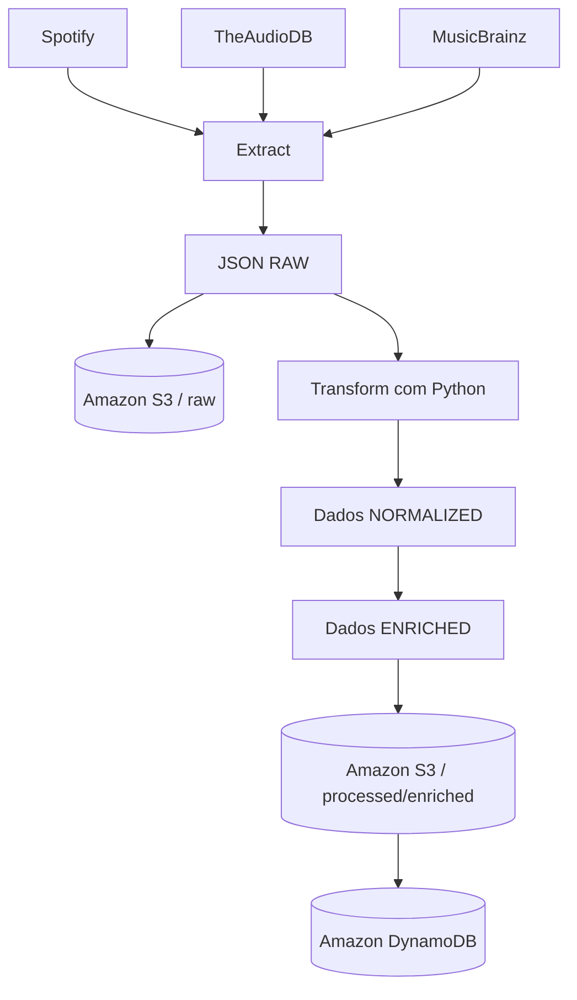

# SoundScope

SoundScope é uma plataforma web de dados musicais em construção. O projeto reunirá dados públicos de artistas vindos do **Spotify**, **TheAudioDB** e **MusicBrainz** e apresentará uma visão única, organizada e rastreável dessas informações.

> **Status:** Fase atual: 12 — AWS Lambda para execução do pipeline de artistas.

## Objetivo

Este é um projeto de portfólio voltado a **Engenharia de Dados**. Mais do que criar um site de música, ele pretende demonstrar de modo didático o caminho completo de um dado: da API externa até uma aplicação web.

O desafio técnico é integrar respostas HTTP/JSON com formatos diferentes, preservar sua origem, limpar e padronizar os registros, enriquecer uma fonte com outra e disponibilizar o resultado para consulta. A arquitetura privilegia simplicidade, responsabilidades claras e decisões fáceis de justificar em uma entrevista técnica.

## Visão do produto

Quando concluído, o SoundScope deverá permitir:

- pesquisar um artista e consultar nome, imagens, gênero, país, formação, biografia, integrantes e discografia;
- conectar opcionalmente uma conta Spotify por OAuth;
- visualizar perfil, artistas e faixas mais ouvidos e reproduções recentes, conforme os períodos suportados pela API;
- entender de qual fonte veio cada informação e quando ela foi atualizada.

Recomendação musical e Machine Learning **não fazem parte do escopo**.

## Pipeline de dados



Em termos simples:

```text
Fontes externas -> Extração -> RAW -----> Amazon S3
                              `--------> Transformação -> NORMALIZED
                                                        -> Enrichment -> ENRICHED
                                                        -> S3 processed/enriched
                                                        -> DynamoDB
```

### Extract (extração)

A aplicação envia requisições HTTP às APIs e recebe documentos JSON. A resposta é preservada com o mínimo possível de alterações, juntamente com metadados úteis de rastreabilidade, antes de qualquer regra de negócio. Isso possibilita auditoria e reprocessamento.

O fluxo executável agora cobre **Extract**, persistência **RAW**, **Transform** e
**Enrichment**:

```text
TheAudioDB  ──► Extract ──► RAW ──┬──► Amazon S3
                                  └──► Transform ──► NORMALIZED ──┐
                                                                  ├──► Enrichment ──► ENRICHED
MusicBrainz ──► Extract ──► RAW ──┬──► Amazon S3                  │
                                  └──► Transform ──► NORMALIZED ──┘
```

O usuário informa o nome de um artista e cada cliente Python devolve o JSON original recebido. No TheAudioDB, o `idArtist` permite consultar os álbuns; no MusicBrainz, o MBID permite consultar detalhes do artista. Os transformers recebem esses documentos sem modificá-los e criam novos modelos normalizados. A combinação acontece somente depois e também cria um novo objeto; RAW e NORMALIZED permanecem intactos.

### Transform (transformação)

O código Python seleciona poucos campos relevantes, trata ausências e padroniza nomes em dataclasses imutáveis. Por exemplo, `strArtist` no TheAudioDB e `name` no MusicBrainz tornam-se `name` no modelo interno. `idArtist` e `id` tornam-se `source_artist_id`, enquanto `source` mantém explícita a procedência.

O modelo `NormalizedArtist` contém `source`, `source_artist_id`, `name`, `country`, `genre`, `formed_year`, `biography` e `image_url`. Somente identificador e nome são obrigatórios; atributos não fornecidos pela fonte recebem `None`, sem informação inventada. O modelo `NormalizedAlbum` mantém a fonte, IDs de álbum e artista, nome, ano e capa.

Exemplo da mudança de esquema, sem alterar o objeto RAW:

```text
TheAudioDB:  strArtist ──► name
MusicBrainz: name      ──► name
```

```python
from src.pipeline.transformers import (
    transform_musicbrainz_artist,
    transform_theaudiodb_artist,
)

theaudiodb_normalized = transform_theaudiodb_artist(theaudiodb_raw)
musicbrainz_normalized = transform_musicbrainz_artist(musicbrainz_details_raw)
```

### Data Enrichment (enriquecimento)

Enriquecer significa combinar atributos complementares das duas fontes em um `EnrichedArtist`. Isso é útil porque o TheAudioDB costuma oferecer biografia e imagem, enquanto o MusicBrainz pode complementar país e período de atividade. A camada recebe somente `NormalizedArtist`: ela não faz HTTP nem altera os objetos recebidos.

```text
TheAudioDB NORMALIZED ──┐
                        ├──► ENRICHMENT ──► EnrichedArtist
MusicBrainz NORMALIZED ─┘
```

Antes da combinação, os nomes são comparados ignorando maiúsculas/minúsculas e espaços extras. Nomes diferentes ou fontes nos argumentos errados produzem `ArtistEnrichmentError`; não há fuzzy matching ou Entity Resolution. As prioridades são intencionalmente simples:

- nome: TheAudioDB, depois da validação de identidade;
- país e ano de formação: MusicBrainz;
- gênero, biografia e imagem: TheAudioDB, pois esses atributos são mais descritivos nessa integração.

Para cada atributo, se a fonte preferencial não tiver valor, a outra é usada; se ambas não tiverem, o resultado é `None`. Nenhuma informação é inventada. `source_ids` preserva os IDs do TheAudioDB e do MusicBrainz, oferecendo rastreabilidade sem criar um sistema complexo de lineage.

```python
from src.pipeline.enrichment import enrich_artist

enriched = enrich_artist(theaudiodb_normalized, musicbrainz_normalized)
```

### Persistência RAW no Amazon S3

`save_raw_json()` recebe o documento que o cliente já extraiu; a camada de
storage não consulta APIs nem transforma dados. O corpo do objeto S3 é o próprio
JSON recebido, sem envelope. Fonte, tipo, identificador e instante de extração
UTC ficam na chave:

```text
raw/<source>/<entity_type>/<entity_id>/<YYYYMMDDTHHMMSSffffffZ>.json
```

Por exemplo:

```text
raw/theaudiodb/artists/123/20260910T150000000000Z.json
```

O timestamp com microssegundos evita a sobrescrita silenciosa de extrações
anteriores, sem introduzir particionamento complexo. Guardar o RAW preserva a
resposta original para auditoria, reprocessamento e consulta do histórico.

O bucket deve existir e ser configurado externamente em
`SOUNDSCOPE_S3_BUCKET`. O código não cria bucket, infraestrutura, políticas ou
ACLs. O boto3 usa sua cadeia padrão de credenciais (por exemplo, perfil local,
variáveis AWS padronizadas ou role do ambiente) e sua configuração padrão de
região; nenhuma credencial é mantida no repositório.

```python
from src.storage import save_raw_json

key = save_raw_json("theaudiodb", raw_document, "artists", "123")
```

Os documentos normalizados de artistas do novo fluxo completo também são
mantidos no mesmo bucket, sob o prefixo `processed/` descrito na Fase 9.

### Fase 8 — Orquestração da ingestão

A camada de ingestão conecta o cliente e o storage que já existem em um fluxo
único:

```text
artist_name → TheAudioDB → RAW → S3
```

`ingest_theaudiodb_artist()` solicita ao cliente o JSON original, obtém o
`idArtist` do primeiro artista utilizável e entrega exatamente o mesmo objeto a
`save_raw_json()`. O resultado informa o nome pesquisado, o ID, a fonte e a
chave criada no S3.

Essa camada apenas coordena componentes existentes. Ela não transforma, não
enriquece e não modifica o documento RAW antes da persistência.

### Fase 9 — Transformação e camada processed

O novo `process_theaudiodb_artist()` coordena o caminho completo sem mudar o
comportamento de `ingest_theaudiodb_artist()`:

```text
TheAudioDB → RAW → S3 raw/ → Transform → NormalizedArtist → S3 processed/
```

Primeiro, o JSON original é salvo em `raw/`; somente depois o mesmo objeto é
entregue a `transform_theaudiodb_artist()`. A dataclass `NormalizedArtist`
resultante é convertida explicitamente em um dicionário e persistida em
`processed/`. Falhas de cliente, validação, storage ou transformação são
propagadas ao chamador, em vez de produzir um falso sucesso.

- `raw/` contém a resposta original da fonte externa, adequada para auditoria
  e reprocessamento;
- `processed/` contém os dados transformados para o modelo interno do
  SoundScope, adequados ao consumo consistente por etapas posteriores.

As chaves processadas seguem a convenção histórica:

```text
processed/artists/<artist_id>/<YYYYMMDDTHHMMSSffffffZ>.json
```

O timestamp UTC com microssegundos preserva versões anteriores, assim como na
camada RAW. O bucket continua sendo fornecido por `SOUNDSCOPE_S3_BUCKET`; este
fluxo não cria recursos AWS.

```python
from src.pipeline.processing import process_theaudiodb_artist

result = process_theaudiodb_artist("Metallica")
```

### Fase 10 — Multi-source Data Enrichment

O `process_enriched_artist()` coordena o fluxo completo das duas fontes sem
assumir responsabilidades dos clients, transformers, enrichment ou storage:

```text
TheAudioDB  ─┐
             ├──► Normalize ──► Enrich ──► processed/
MusicBrainz ─┘
```

As respostas usadas são preservadas separadamente em `raw/theaudiodb/` e
`raw/musicbrainz/` (incluindo a busca e os detalhes do MusicBrainz). Manter o RAW de cada fonte permite
auditar o que cada API realmente retornou e reprocessar os dados quando o
esquema interno evoluir. A normalização vem antes do enrichment para que as
regras de combinação operem sobre um formato comum, sem conhecer os diferentes
nomes e formatos de campos das APIs.

Para tolerar indisponibilidades breves durante esse fluxo, o cliente
MusicBrainz aplica retry limitado somente a respostas HTTP transitórias, sem
transferir essa responsabilidade para a orquestração da Fase 10.

O enrichment cria um terceiro objeto e nunca modifica os RAW originais nem os
dois `NormalizedArtist`. Um registro **normalized** representa uma única fonte
no esquema comum; um registro **enriched** combina os valores complementares e
mantém os identificadores das duas fontes. O documento final usa a convenção:

```text
processed/enriched/artists/<theaudiodb_artist_id>/<YYYYMMDDTHHMMSSffffffZ>.json
```

Essa nova subdivisão não altera as chaves normalizadas da Fase 9. O pipeline
retorna ambos os IDs e todas as chaves S3 criadas para rastreabilidade.

```python
from src.pipeline.processing import process_enriched_artist

result = process_enriched_artist("Metallica")
```

### Fase 11 — Persistência do artista enriquecido no DynamoDB

Depois que o documento enriquecido foi salvo com sucesso em
`processed/enriched/` no S3, `process_enriched_artist()` grava a mesma visão
para consulta na tabela DynamoDB já existente. A ordem é deliberada:

```text
APIs → RAW S3 → Transform → Enrichment → processed/enriched S3 → DynamoDB
```

`save_enriched_artist()` usa o ID do TheAudioDB presente em `source_ids` como
partition key `artist-id`. O item inclui nome, atributos enriquecidos,
`source_ids` e `updated_at`; atributos opcionais com valor `None` são omitidos.
O mapa `source_ids` permanece nativo e consultável no DynamoDB.

A tabela não é criada pelo código. Seu nome vem de
`SOUNDSCOPE_DYNAMODB_TABLE` (por exemplo, `soundscope-artists`), e o boto3 usa a
cadeia padrão de credenciais e região. Uma falha do DynamoDB é reportada como
`DynamoDBStorageError`, preservando a exceção original; o pipeline não retorna
sucesso silenciosamente. Da mesma forma, nenhuma tentativa de gravação no
DynamoDB ocorre se uma etapa anterior, inclusive o S3 processed, falhar.

```python
from src.storage import save_enriched_artist

save_enriched_artist(enriched)
```

### Fase 12 — AWS Lambda

A função Lambda transforma o pipeline Python existente em um backend serverless
executável sob demanda. O handler recebe o parâmetro de rota `artist_name`,
executa `process_enriched_artist()` e devolve uma resposta compatível com Lambda
Proxy Integration. A futura rota será `GET /artist/{artist_name}`; o API Gateway
será criado somente na próxima fase.

Em uma resposta HTTP 200, `artist` contém todos os campos reais do
`EnrichedArtist` produzido pelo pipeline (incluindo valores opcionais nulos e
`source_ids`), enquanto `metadata` preserva os identificadores, a origem e as
chaves de rastreabilidade no S3. O frontend recebe os dados diretamente na
resposta e não precisa acessar o bucket:

```json
{
  "artist": {
    "name": "Metallica",
    "country": "US",
    "genre": "Metal",
    "formed_year": "1981",
    "biography": null,
    "image_url": "https://example.com/metallica.jpg",
    "source_ids": {
      "theaudiodb": "111279",
      "musicbrainz": "mbid-1"
    }
  },
  "metadata": {
    "artist_name": "Metallica",
    "theaudiodb_artist_id": "111279",
    "musicbrainz_mbid": "mbid-1",
    "source": "theaudiodb+musicbrainz",
    "theaudiodb_raw_s3_key": "raw/theaudiodb/artists/...",
    "musicbrainz_raw_s3_key": "raw/musicbrainz/artists/...",
    "processed_s3_key": "processed/enriched/artists/..."
  }
}
```

Os erros continuam usando os status 400, 404 e 500 e o cabeçalho CORS é
mantido em todas as respostas.

```text
Internet
  → API Gateway (próxima fase)
  → AWS Lambda
  → SoundScope pipeline
  → APIs externas
  → Amazon S3
  → Amazon DynamoDB
```

Configure o campo **Handler** da função exatamente como:

```text
src.handlers.artist.lambda_handler
```

As variáveis de ambiente da Lambda deverão ser configuradas sem armazenar
segredos no repositório:

```text
SOUNDSCOPE_S3_BUCKET=soundscope-data-zampieri
SOUNDSCOPE_DYNAMODB_TABLE=soundscope-artists
THEAUDIODB_API_KEY=<configurar externamente; não versionar o segredo>
MUSICBRAINZ_USER_AGENT=<aplicação/versão e contato apropriados>
```

Durante o desenvolvimento, todas as respostas incluem
`Access-Control-Allow-Origin: *`. Essa origem deve ser restringida ao domínio do
frontend antes de uma implantação de produção.

Para criar o pacote implantável (sem executar deploy), rode:

```bash
./scripts/build_lambda.sh
```

O artefato será gerado em `dist/soundscope-lambda.zip`, contendo `src/` e as
dependências declaradas. O diretório `dist/` é ignorado pelo Git.

A futura execution role deve seguir o princípio do menor privilégio e permitir
somente:

- escrita de logs no CloudWatch Logs (criação do log group/stream e eventos);
- `s3:PutObject` no bucket `soundscope-data-zampieri`, limitado aos prefixos
  `raw/` e `processed/` utilizados pelo pipeline;
- `dynamodb:PutItem` somente na tabela `soundscope-artists`.

Esta fase não cria role, usuário, access key, recurso AWS ou infraestrutura como
código. As credenciais são obtidas pela role de execução padrão da Lambda.

## RAW x NORMALIZED x ENRICHED

| Camada | Conteúdo | Finalidade |
| --- | --- | --- |
| **RAW** | JSON praticamente igual ao recebido de cada API | Auditoria, histórico, comparação e reprocessamento |
| **NORMALIZED / processed** | Novo objeto de uma única fonte no esquema comum | Entrada consistente e independente para etapas posteriores |
| **ENRICHED** | Novo objeto que combina os dois registros normalizados | Visão complementar do artista com os IDs das fontes |

NORMALIZED não significa enriquecido: cada modelo normalizado continua associado a uma única fonte. Na Fase 9, esse modelo pode ser serializado na camada PROCESSED. ENRICHED é outro objeto, criado sem sobrescrever RAW ou NORMALIZED.

Estrutura conceitual desta fase no bucket (o nome real é configurável):

```text
soundscope-data/
├── raw/
│   ├── theaudiodb/
│   └── musicbrainz/
└── processed/
    ├── artists/
    └── enriched/
        └── artists/
```

Essa separação representa uma forma simples de **Data Lake**: o original não é sobrescrito pelo dado preparado para consumo.

## Fontes de dados planejadas

- **Spotify Web API:** perfil e hábitos musicais autorizados pelo usuário. A autenticação será feita futuramente por OAuth; segredos e tokens nunca serão versionados.
- **TheAudioDB:** primeira fonte integrada; permite pesquisar um artista e consultar seus álbuns, preservando as respostas JSON originais.
- **MusicBrainz:** segunda fonte integrada; pesquisa artistas e consulta detalhes, aliases, gêneros, tags e relações entre artistas por MBID, mantendo o JSON RAW.

Spotify continua apenas planejado e não possui cliente implementado.

## Arquitetura AWS planejada

```text
Usuário
  |
Frontend web
  |
Amazon API Gateway
  |
AWS Lambda (Python)
  |---------------- Spotify / TheAudioDB / MusicBrainz
  |
JSON original -> Amazon S3 (RAW)
  |
AWS Lambda (transformação)
  |---------------- Amazon S3 (PROCESSED)
  `---------------- Amazon DynamoDB
                         |
                 API Gateway -> Frontend

Logs e métricas das funções -> Amazon CloudWatch
```

### Por que esses serviços?

- **AWS Lambda:** executa extrações, transformações e handlers Python sem manter servidores. É adequada a cargas pequenas e orientadas a eventos.
- **Amazon API Gateway:** expõe rotas HTTP e encaminha cada chamada ao handler responsável, separando a interface pública da execução.
- **Amazon S3:** oferece armazenamento durável e econômico para JSON RAW e arquivos processados, preservando o histórico do pipeline.
- **Amazon DynamoDB:** armazena a visão enriquecida por `artist-id` para consultas rápidas, sem administrar um banco relacional.
- **Amazon CloudWatch:** centralizará logs, métricas e alertas básicos para investigar falhas de APIs e execuções Lambda.

A proposta é **serverless** e intencionalmente pequena. EC2, ECS, Kubernetes, RDS, Redshift, Kafka, Airflow e AWS Glue não serão adicionados ao MVP sem uma necessidade real.

## Endpoints previstos

Estes caminhos apenas orientam a evolução; ainda não estão disponíveis:

```text
GET /artist/{artist_name}
GET /spotify/login
GET /spotify/callback
GET /spotify/top-artists
GET /spotify/top-tracks
GET /spotify/recent
```

## Frontend web

A primeira versão da interface do **SoundScope** está em `frontend/` e usa apenas
HTML, CSS e JavaScript, sem build, framework ou dependências de execução. Ela
pesquisa artistas, apresenta os campos públicos do perfil e mantém metadados
internos (IDs e chaves S3) fora da interface. A arquitetura de consulta é:

```text
Navegador (frontend estático)
        │  GET /artist/{artist_name}
        ▼
Amazon API Gateway → AWS Lambda → TheAudioDB + MusicBrainz
                                      │
                                      └→ S3 + DynamoDB
```

### Executar localmente

Sirva a pasta por HTTP a partir da raiz do repositório:

```bash
python -m http.server 8080 --directory frontend
```

Abra `http://localhost:8080`, digite `Metallica` e selecione **Buscar** (ou
pressione Enter). Abrir o HTML diretamente com `file://` não é recomendado,
pois as políticas do navegador e os caminhos relativos podem se comportar de
forma diferente.

### Configuração da API

A URL pública fica centralizada em `API_BASE_URL`, no início de
`frontend/js/app.js`. Para apontar a interface para outro estágio ou API, altere
apenas essa constante, sem adicionar credenciais, tokens ou segredos. O nome do
artista é codificado com `encodeURIComponent` antes de compor a rota.

### Publicação estática

Todo o conteúdo de `frontend/` pode ser publicado diretamente em um host de
arquivos estáticos, como Amazon S3 com CloudFront, AWS Amplify Hosting, GitHub
Pages ou Netlify. Configure `frontend/index.html` como documento inicial e
preserve as pastas `css/`, `js/` e `assets/`. Não há comando de build. Em
produção, prefira HTTPS e, no caso de S3, mantenha o bucket privado atrás do
CloudFront em vez de habilitar acesso público irrestrito.

### CORS no API Gateway

Como navegador e API usam origens diferentes, o API Gateway precisa responder
com CORS. A resposta da rota `GET /artist/{artist_name}` — inclusive respostas
de erro — deve incluir `Access-Control-Allow-Origin` com o domínio publicado do
frontend (ou `*` para uma demonstração pública sem credenciais) e permitir o
método `GET` e o header `Content-Type`/`Accept`. Se o API Gateway exigir uma
requisição preflight, configure também `OPTIONS` com `Access-Control-Allow-Methods: GET,OPTIONS`
e `Access-Control-Allow-Headers: Content-Type,Accept`. Após alterar CORS, faça o
deploy do estágio da API. Esta documentação não modifica a infraestrutura AWS.

## Estrutura do repositório

```text
soundscope/
├── .env.example          # catálogo seguro das variáveis de ambiente
├── .gitignore            # arquivos locais, segredos e artefatos ignorados
├── README.md             # visão do produto, arquitetura e roteiro
├── requirements.txt      # dependências Python diretas e mínimas
├── docs/                 # documentação técnica futura
├── frontend/             # base da futura aplicação web
├── src/                  # pacote principal do backend Python
│   ├── handlers/         # handler da função Lambda/API
│   ├── models/           # modelos de dados normalizados
│   ├── pipeline/         # transformers, enrichment e orquestração
│   ├── services/         # clientes das fontes externas
│   │   ├── musicbrainz/
│   │   ├── spotify/
│   │   └── theaudiodb/   # cliente HTTP e runner manual
│   ├── storage/          # persistência no S3 e no DynamoDB
│   └── utils/            # utilitários pequenos e compartilhados
└── tests/                # testes automatizados espelhando o código de src
```

Os arquivos `__init__.py` identificam os diretórios Python como pacotes. Os clientes em `theaudiodb/` e `musicbrainz/` são independentes e não compartilham nem combinam seus documentos.

## Configuração local

### Pré-requisitos

- Python 3.11 ou superior;
- Git;
- ambiente virtual Python (recomendado).

```bash
git clone <URL_DO_REPOSITORIO>
cd soundscope
python -m venv .venv
source .venv/bin/activate       # Windows: .venv\Scripts\activate
python -m pip install -r requirements.txt
cp .env.example .env
```

Preencha `THEAUDIODB_API_KEY` no `.env` e exporte a variável no terminal. O
projeto usa `requests` para HTTP e `boto3` para S3. Para pesquisar no TheAudioDB
e visualizar o JSON RAW:

```bash
export THEAUDIODB_API_KEY="sua_chave_aqui"
python -m src.services.theaudiodb.search_artist Metallica
```

Exemplo conceitual (os campos e valores reais são definidos pela API):

```json
{
  "artists": [
    {
      "idArtist": "...",
      "strArtist": "Metallica",
      "strGenre": "Metal"
    }
  ]
}
```

Copie o valor de `idArtist` retornado e use-o para extrair a discografia:

```bash
python -m src.services.theaudiodb.search_albums 111279
```

O comando imprime a resposta RAW da API, cuja chave `album` contém a lista de álbuns. Cada consulta permanece independente. Os documentos podem depois ser passados a `transform_theaudiodb_artist()` e `transform_theaudiodb_albums()`; os clientes HTTP continuam responsáveis apenas pela extração.

### MusicBrainz

A pesquisa segue a [documentação oficial de busca](https://musicbrainz.org/doc/MusicBrainz_API/Search) e usa `GET https://musicbrainz.org/ws/2/artist/`, com `query` contendo o nome e `fmt=json`. Por exemplo:

```bash
python -m src.services.musicbrainz.search_artist Metallica
```

O documento RAW contém uma lista `artists`. Copie o campo `id` (o MBID) do resultado desejado e faça o [lookup oficial](https://musicbrainz.org/doc/MusicBrainz_API#Lookups) em `GET https://musicbrainz.org/ws/2/artist/{MBID}`:

```bash
python -m src.services.musicbrainz.artist_details 65f4f0c5-ef9e-490c-aee3-909e7ae6b2ab
```

A consulta de detalhes envia `fmt=json` e `inc=aliases+genres+tags+artist-rels`. Assim, a própria API pode incluir aliases, classificações e relações com outros artistas — inclusive relações de integrantes quando cadastradas — sem o SoundScope interpretar ou completar esses dados.

Todas as chamadas enviam `Accept: application/json` e um User-Agent identificável. O padrão é `SoundScope/1.0 (https://github.com/zampieri05/soundscope)`; ele pode ser substituído por `MUSICBRAINZ_USER_AGENT`, mantendo o formato `Aplicação/versão (URL ou e-mail de contato)` recomendado pelo MusicBrainz. Nenhuma credencial é necessária. O cliente também limita as chamadas iniciadas pelo mesmo processo a uma por segundo, conforme as regras oficiais de [rate limiting e identificação](https://musicbrainz.org/doc/MusicBrainz_API/Rate_Limiting). Respostas HTTP transitórias (`429`, `500`, `502`, `503` e `504`) têm no máximo três tentativas no total, com esperas de 1 e 2 segundos; um `Retry-After` válido substitui o backoff, limitado com segurança a 60 segundos. Os demais erros não são retentados.

O cliente continua devolvendo exatamente o formato recebido. Separadamente, `transform_musicbrainz_artist()` aceita o RAW de detalhes e cria um `NormalizedArtist`; ele não resolve integrantes nem combina o resultado com o TheAudioDB. A presença e a qualidade de país, período de atividade e gênero dependem do cadastro colaborativo do MusicBrainz.

O cliente trata entradas vazias, configuração ausente, timeout, erro HTTP, JSON inválido, estrutura inesperada e resultados não encontrados. Os testes usam mocks e, portanto, não dependem da disponibilidade da API:

```bash
python -m unittest discover -s tests -v
```

## Variáveis de ambiente

O arquivo `.env.example` documenta apenas os nomes esperados:

| Variável | Uso |
| --- | --- |
| `THEAUDIODB_API_KEY` | autentica as consultas de artistas e álbuns no TheAudioDB |
| `MUSICBRAINZ_USER_AGENT` | identifica aplicação, versão e contato nas consultas ao MusicBrainz |
| `SPOTIFY_CLIENT_ID` | identificação pública do aplicativo Spotify |
| `SPOTIFY_CLIENT_SECRET` | segredo do aplicativo Spotify |
| `SPOTIFY_REDIRECT_URI` | retorno do fluxo OAuth |
| `AWS_REGION` | região opcional usada pela configuração padrão da AWS |
| `SOUNDSCOPE_S3_BUCKET` | nome do bucket externo usado para documentos RAW e processed |
| `SOUNDSCOPE_DYNAMODB_TABLE` | nome da tabela externa que recebe o artista enriquecido |

Copie o exemplo para `.env` e preencha-o apenas em sua máquina. Nesta fase,
`THEAUDIODB_API_KEY` é obrigatória para o TheAudioDB;
`MUSICBRAINZ_USER_AGENT` é opcional porque há um valor público seguro como
padrão; `SOUNDSCOPE_S3_BUCKET` é obrigatório ao salvar RAW ou processed; e
`SOUNDSCOPE_DYNAMODB_TABLE` é obrigatório no fluxo enriquecido. Não
adicione credenciais AWS ao arquivo: o boto3 descobre credenciais pela cadeia
padrão do SDK.

## Segurança

- nunca faça commit de `.env`, credenciais AWS, client secrets, access tokens, refresh tokens, senhas ou chaves privadas;
- use variáveis de ambiente localmente e um gerenciador de segredos quando houver implantação;
- revise `git status` antes de cada commit;
- conceda às futuras funções Lambda somente as permissões necessárias;
- não registre tokens ou dados sensíveis no CloudWatch.

Se um segredo for versionado por engano, removê-lo do arquivo não basta: ele deve ser revogado e substituído.

## Tecnologias

| Categoria | Tecnologia | Situação |
| --- | --- | --- |
| Backend e transformação | Python | modelos, transformers e enrichment implementados |
| Formato de troca | JSON sobre HTTP | extrações RAW implementadas |
| Fontes | TheAudioDB | pesquisa de artista e álbuns implementada |
| Fontes | MusicBrainz | pesquisa e detalhes RAW por MBID implementados |
| Fonte futura | Spotify | planejada |
| Data Lake | Amazon S3 | persistência RAW, processed e enriched implementada |
| Banco de consulta | Amazon DynamoDB | persistência de artistas enriquecidos implementada |
| Computação e API | Lambda implementada; API Gateway | próxima fase |
| Observabilidade | CloudWatch | planejado |
| Frontend | HTML, CSS e JavaScript puros | primeira versão funcional |

## Roadmap

- [x] **Fase 1:** estrutura inicial do projeto
- [x] **Fase 2:** primeira extração real de API (TheAudioDB)
- [x] **Fase 3:** integração TheAudioDB (artista e discografia RAW)
- [x] **Fase 4:** integração MusicBrainz
- [x] **Fase 5:** transformação e normalização
- [x] **Fase 6:** Data Enrichment
- [x] **Fase 7:** persistência RAW no Amazon S3
- [x] **Fase 8:** orquestração da ingestão TheAudioDB
- [x] **Fase 9:** transformação e persistência processada
- [x] **Fase 10:** Multi-source Data Enrichment
- [x] **Fase 11:** persistência do artista enriquecido no DynamoDB
- [x] **Fase 12:** AWS Lambda para o pipeline de artistas (API Gateway na próxima fase)
- [ ] **Fase 13:** Spotify OAuth
- [ ] **Fase 14:** dados pessoais Spotify
- [x] **Fase 15:** primeira versão funcional do frontend
- [ ] **Fase 16:** CloudWatch, logs e tratamento de erros
- [ ] **Fase 17:** testes e documentação final

Cada fase deve produzir uma mudança pequena, testável e explicável. A prioridade é demonstrar integração de APIs, ingestão, ETL, normalização, deduplicação, enriquecimento, persistência, arquitetura serverless, observabilidade e tratamento de falhas — sem adicionar ferramentas apenas para aumentar a lista de tecnologias.

## Estado atual e próximos limites

As extrações RAW do TheAudioDB e MusicBrainz, a persistência opcional desses
documentos em um bucket S3 configurado externamente, suas transformações
independentes e o enriquecimento estão prontos. O fluxo TheAudioDB também
persiste seu `NormalizedArtist` na camada processed, e o fluxo multi-source
persiste `EnrichedArtist` no S3 antes de atualizar a tabela DynamoDB externa.
Nenhum recurso AWS é criado pelo projeto. O handler e o empacotamento da Lambda
estão prontos, mas a integração Spotify e as evoluções de observabilidade
continuam para fases futuras; a API Gateway pública e a primeira versão do frontend estão disponíveis.

## Artist Profile enriquecido

O pipeline entrega agora um dossiê completo e retrocompatível, incluindo biografia,
integrantes e todos os lançamentos válidos coletados (data, identificadores e capa quando confirmada):

```text
TheAudioDB + MusicBrainz
          ↓
      Normalization
          ↓
    Enriched Artist
          ↓
    S3 + DynamoDB
          ↓
 Lambda / API Gateway
          ↓
 SoundScope frontend
```

O TheAudioDB é a fonte prioritária de biografia (português, com fallback para
inglês), gênero, imagem, IDs e catálogo/capas. O MusicBrainz fornece país, período,
relações de integrantes e release groups complementares. O MusicBrainz não confirma capas nesta integração, portanto esses itens mantêm
`cover_url=null` e o frontend usa seu placeholder. Dados não informados permanecem
`null` ou listas vazias; nenhum conteúdo biográfico é gerado. Relações e catálogos
dependem da cobertura editorial das APIs.

## Spotify Integration

O frontend usa o **Authorization Code Flow with PKCE (S256)** diretamente com o Spotify. O Client ID público fica centralizado em `frontend/js/spotify-auth.js`; nenhum Client Secret é necessário ou aceito nesse fluxo. A URI de redirecionamento é `https://d3pzcehppsvhm0.cloudfront.net/` e deve ser cadastrada exatamente assim no Spotify Developer Dashboard.

O escopo OAuth solicitado é somente `user-top-read`. Usuários que autorizaram o SoundScope antes da inclusão desse escopo podem precisar **desconectar o Spotify, conectar novamente e autorizar o novo acesso**.

Além do perfil básico em `/v1/me`, a seleção de um álbum na timeline faz uma consulta sob demanda ao endpoint disponível em Development Mode `GET /v1/search`, com `type=album` e limite de 10 resultados. A consulta nunca ocorre em lote ao renderizar a discografia. O URL de reprodução é exclusivamente `external_urls.spotify`, retornado pela API, e abre no Spotify em outra aba.

A área **Meu SoundScope** usa `GET /v1/me/top/artists` e `GET /v1/me/top/tracks`, com limite de 10 itens, nos períodos `short_term` (aproximadamente 4 semanas), `medium_term` (aproximadamente 6 meses) e `long_term` (afinidade de longo prazo). As listas normalizadas são mantidas apenas no `sessionStorage`, em chaves separadas por tipo e período; o access token nunca integra esse cache. A troca de período reutiliza resultados já consultados sem recarregar a página.

O matching é determinístico: exige artista normalizado idêntico, título idêntico ou a mesma base após remover qualificadores editoriais conhecidos (como Deluxe, Remastered, Anniversary e Expanded), ano igual ou com diferença máxima de um ano quando ambos existem, tipo `album` preferencial e URL/ID válidos. Título integral, ano exato e álbum original recebem maior pontuação; candidatos empatados ou próximos são tratados como ambíguos e não geram link.

Resultados confirmados, ausentes e ambíguos ficam em `sessionStorage`, sem token no cache, e consultas simultâneas iguais são reutilizadas em memória. O cache pode ser apagado sem impacto funcional. Sem sessão Spotify, com token expirado, rate limit, timeout ou falha de rede, apenas o estado discreto do álbum selecionado é atualizado; busca, biografia, integrantes e timeline continuam independentes. Diferenças de metadados superiores a um ano, artistas convidados creditados de outra forma e edições com títulos não reconhecidos podem resultar, deliberadamente, em nenhum link.

Nenhum outro scope é solicitado além de `user-top-read`. E-mail, playlists, histórico, biblioteca e reprodução não são solicitados. `code_verifier`, `state`, access token, expiração e o perfil mínimo ficam somente em `sessionStorage`; fechar a aba encerra a sessão. O refresh token não é persistido nem utilizado nesta fase.

Para testar localmente, sirva `frontend/` via HTTP, mas observe que o fluxo retorna à URI de produção cadastrada. Em Development Mode, a conta usada no teste precisa estar autorizada no app pelo Spotify Dashboard. O teste completo também exige que a URI acima esteja na allowlist de Redirect URIs. Execute os testes puros com `node --test tests/spotify-auth.test.js tests/spotify-catalog.test.js tests/spotify-insights.test.js`.

## Hotfix de cobertura: busca e discografia

A busca de artista consulta TheAudioDB e MusicBrainz de forma independente. Se uma
fonte não encontrar o artista ou estiver temporariamente indisponível, a resposta
continua com a outra fonte quando ela produzir um resultado confiável; `404` fica
reservado para ausência nas duas fontes. `metadata.sources` informa exatamente
quais fontes contribuíram. Um perfil somente MusicBrainz não é escrito na tabela
DynamoDB atual, cuja chave exige o ID TheAudioDB; ele continua disponível na
resposta e na camada processed, sem migração ou alteração de infraestrutura.

A seleção MusicBrainz exige correspondência exata do nome canônico ou alias após
normalização Unicode, de caixa, espaços, pontuação básica e diacríticos. Ela ordena
pelo score oficial da busca (mínimo 80), correspondência canônica e sinais
editoriais já retornados (`type`, `country`, `disambiguation`). Esse critério é
determinístico e não cria um “score SoundScope”. Empates indistinguíveis e conflito
de país impedem o perfil híbrido; nesse caso é preferido um perfil de fonte única.

Release groups são coletados em páginas de 100 usando `offset` e o campo
`release-group-count`, passando pelo rate limiter e retries existentes. A coleta
para em página vazia/curta, na contagem declarada ou no teto defensivo de 20 páginas
(2.000 itens), e deduplica IDs repetidos. A resposta RAW agregada é salva uma única
vez, portanto páginas nunca sobrescrevem umas às outras. Durante este hotfix, o
acesso à documentação oficial foi bloqueado pelo proxy do ambiente (HTTP 403); os
nomes e limites usados são os já sustentados pelo contrato existente do cliente e
pelos testes. Antes de produção, deve-se reconfirmar o limite máximo de 100, o
`offset`, `release-group-count` e a política publicada de uma requisição por
segundo nos links oficiais já citados na seção MusicBrainz.

O domínio não limita mais a discografia a 20 itens. `primary_type`,
`secondary_types`, `first_release_date` e o ID do release group são opcionais e
preservados, inclusive para Album, EP, Single, Broadcast e demais tipos reais.
URLs do Cover Art Archive não são fabricadas: sem confirmação, `cover_url` é
`null`. A deduplicação prioriza IDs e só usa título/data normalizados de modo
conservador entre fontes; qualificadores editoriais não são removidos.

No frontend, somente os primeiros 20 lançamentos entram inicialmente no DOM; o
botão **Carregar mais** acrescenta blocos de 20 sem descartar o catálogo recebido.
As etiquetas de categoria usam exclusivamente tipos primários/secundários, e capa,
ano ou tipo ausentes mantêm os fallbacks existentes. O painel de fontes também
passa a refletir perfis parciais. Discografias excepcionais podem exigir até 20
chamadas MusicBrainz sequenciais e, pelo rate limit, aproximar ou exceder o timeout
do navegador de 15 segundos; o timeout não foi aumentado e este risco permanece
para revisão operacional.
