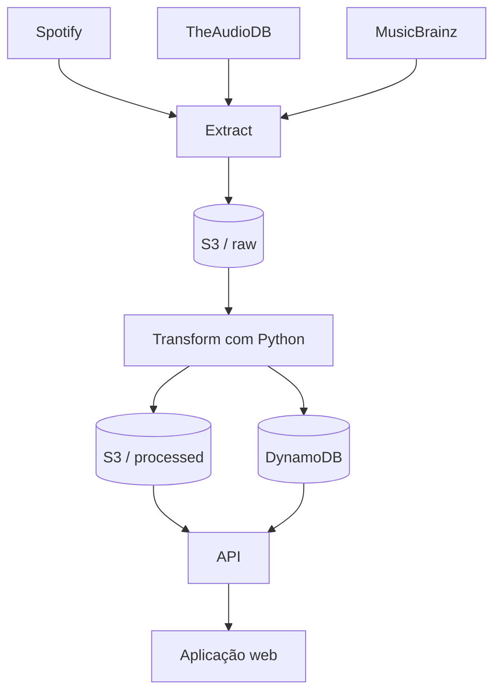

# SoundScope

SoundScope é uma plataforma web de dados musicais em construção. O projeto reunirá dados públicos de artistas vindos do **Spotify**, **TheAudioDB** e **MusicBrainz** e apresentará uma visão única, organizada e rastreável dessas informações.

> **Status:** Fase 5 — transformação e normalização independente por fonte.

## Objetivo

Este é um projeto de portfólio voltado a **Engenharia de Dados**. Mais do que criar um site de música, ele pretende demonstrar de modo didático o caminho completo de um dado: da API externa até uma aplicação web.

O desafio técnico é integrar respostas HTTP/JSON com formatos diferentes, preservar sua origem, limpar e padronizar os registros, enriquecer uma fonte com outra e disponibilizar o resultado para consulta. A arquitetura privilegia simplicidade, responsabilidades claras e decisões fáceis de justificar em uma entrevista técnica.

## Visão do produto

Quando concluído, o SoundScope deverá permitir:

- pesquisar um artista e consultar nome, imagens, gênero, país, formação, biografia, integrantes e discografia;
- conectar opcionalmente uma conta Spotify por OAuth;
- visualizar perfil, artistas e faixas mais ouvidos e reproduções recentes, conforme os períodos suportados pela API;
- entender de qual fonte veio cada informação e quando ela foi atualizada.

Recomendação musical e Machine Learning **não fazem parte do escopo**.

## Pipeline de dados



Em termos simples:

```text
Fontes externas -> Extração -> JSON original -> RAW
               -> Transformação e enriquecimento -> PROCESSED
               -> Persistência -> API -> Frontend
```

### Extract (extração)

A aplicação envia requisições HTTP às APIs e recebe documentos JSON. A resposta é preservada com o mínimo possível de alterações, juntamente com metadados úteis de rastreabilidade, antes de qualquer regra de negócio. Isso possibilita auditoria e reprocessamento.

O fluxo executável agora cobre **Extract** e **Transform**:

```text
TheAudioDB  ──► Extract ──► RAW ──► Transform ──► NORMALIZED TheAudioDB
MusicBrainz ──► Extract ──► RAW ──► Transform ──► NORMALIZED MusicBrainz
```

O usuário informa o nome de um artista e cada cliente Python devolve o JSON original recebido. No TheAudioDB, o `idArtist` permite consultar os álbuns; no MusicBrainz, o MBID permite consultar detalhes do artista. Os transformers recebem esses documentos sem modificá-los e criam novos modelos normalizados. As respostas e os modelos das fontes permanecem separados: **ainda não há combinação, matching, deduplicação ou enriquecimento.**

### Transform (transformação)

O código Python seleciona poucos campos relevantes, trata ausências e padroniza nomes em dataclasses imutáveis. Por exemplo, `strArtist` no TheAudioDB e `name` no MusicBrainz tornam-se `name` no modelo interno. `idArtist` e `id` tornam-se `source_artist_id`, enquanto `source` mantém explícita a procedência.

O modelo `NormalizedArtist` contém `source`, `source_artist_id`, `name`, `country`, `genre`, `formed_year`, `biography` e `image_url`. Somente identificador e nome são obrigatórios; atributos não fornecidos pela fonte recebem `None`, sem informação inventada. O modelo `NormalizedAlbum` mantém a fonte, IDs de álbum e artista, nome, ano e capa.

Exemplo da mudança de esquema, sem alterar o objeto RAW:

```text
TheAudioDB:  strArtist ──► name
MusicBrainz: name      ──► name
```

```python
from src.pipeline.transformers import (
    transform_musicbrainz_artist,
    transform_theaudiodb_artist,
)

theaudiodb_normalized = transform_theaudiodb_artist(theaudiodb_raw)
musicbrainz_normalized = transform_musicbrainz_artist(musicbrainz_details_raw)
```

### Data Enrichment (enriquecimento)

Enriquecer significa combinar atributos complementares. Uma fonte pode fornecer métricas do Spotify, outra uma biografia e outra identificadores e relacionamentos. O resultado será um registro de artista mais completo, sem esconder a procedência de cada dado.

### Load (carga)

Após a transformação, os dados serão gravados na camada processada do S3 e os campos necessários à consulta rápida serão persistidos no DynamoDB. Essa etapa ainda será implementada; o modelo inicial será mantido pequeno e poderá evoluir com o uso real.

## RAW x NORMALIZED

| Camada | Conteúdo | Finalidade |
| --- | --- | --- |
| **RAW** | JSON praticamente igual ao recebido de cada API | Auditoria, histórico, comparação e reprocessamento |
| **NORMALIZED** | Novo objeto com o pequeno esquema comum do SoundScope | Entrada consistente para etapas futuras |

NORMALIZED não significa enriquecido: nesta fase cada modelo continua associado a uma única fonte. O RAW permanece intacto para auditoria e reprocessamento. A camada PROCESSED, a persistência e a combinação entre fontes pertencem a fases posteriores.

Estrutura conceitual futura no bucket:

```text
soundscope-data/
├── raw/
│   ├── spotify/
│   ├── theaudiodb/
│   └── musicbrainz/
└── processed/
    └── artists/
```

Essa separação representa uma forma simples de **Data Lake**: o original não é sobrescrito pelo dado preparado para consumo.

## Fontes de dados planejadas

- **Spotify Web API:** perfil e hábitos musicais autorizados pelo usuário. A autenticação será feita futuramente por OAuth; segredos e tokens nunca serão versionados.
- **TheAudioDB:** primeira fonte integrada; permite pesquisar um artista e consultar seus álbuns, preservando as respostas JSON originais.
- **MusicBrainz:** segunda fonte integrada; pesquisa artistas e consulta detalhes, aliases, gêneros, tags e relações entre artistas por MBID, mantendo o JSON RAW.

Spotify continua apenas planejado e não possui cliente implementado.

## Arquitetura AWS planejada

```text
Usuário
  |
Frontend web
  |
Amazon API Gateway
  |
AWS Lambda (Python)
  |---------------- Spotify / TheAudioDB / MusicBrainz
  |
JSON original -> Amazon S3 (RAW)
  |
AWS Lambda (transformação)
  |---------------- Amazon S3 (PROCESSED)
  `---------------- Amazon DynamoDB
                         |
                 API Gateway -> Frontend

Logs e métricas das funções -> Amazon CloudWatch
```

### Por que esses serviços?

- **AWS Lambda:** executa extrações, transformações e handlers Python sem manter servidores. É adequada a cargas pequenas e orientadas a eventos.
- **Amazon API Gateway:** expõe rotas HTTP e encaminha cada chamada ao handler responsável, separando a interface pública da execução.
- **Amazon S3:** oferece armazenamento durável e econômico para JSON RAW e arquivos processados, preservando o histórico do pipeline.
- **Amazon DynamoDB:** fornece consultas rápidas para a aplicação sem administrar um banco relacional. O modelo será definido apenas quando os padrões de acesso estiverem claros.
- **Amazon CloudWatch:** centralizará logs, métricas e alertas básicos para investigar falhas de APIs e execuções Lambda.

A proposta é **serverless** e intencionalmente pequena. EC2, ECS, Kubernetes, RDS, Redshift, Kafka, Airflow e AWS Glue não serão adicionados ao MVP sem uma necessidade real.

## Endpoints previstos

Estes caminhos apenas orientam a evolução; ainda não estão disponíveis:

```text
GET /artist/{artist_name}
GET /spotify/login
GET /spotify/callback
GET /spotify/top-artists
GET /spotify/top-tracks
GET /spotify/recent
```

## Estrutura do repositório

```text
soundscope/
├── .env.example          # catálogo seguro das variáveis de ambiente
├── .gitignore            # arquivos locais, segredos e artefatos ignorados
├── README.md             # visão do produto, arquitetura e roteiro
├── requirements.txt      # dependências Python diretas e mínimas
├── docs/                 # documentação técnica futura
├── frontend/             # base da futura aplicação web
├── src/                  # pacote principal do backend Python
│   ├── handlers/         # entradas futuras das funções Lambda/API
│   ├── models/           # modelos de dados normalizados
│   ├── pipeline/         # transformers independentes por fonte
│   ├── services/         # clientes das fontes externas
│   │   ├── musicbrainz/
│   │   ├── spotify/
│   │   └── theaudiodb/   # cliente HTTP e runner manual
│   ├── storage/          # acesso futuro a S3 e DynamoDB
│   └── utils/            # utilitários pequenos e compartilhados
└── tests/                # testes automatizados espelhando o código de src
```

Os arquivos `__init__.py` identificam os diretórios Python como pacotes. Os clientes em `theaudiodb/` e `musicbrainz/` são independentes e não compartilham nem combinam seus documentos.

## Configuração local

### Pré-requisitos

- Python 3.11 ou superior;
- Git;
- ambiente virtual Python (recomendado).

```bash
git clone <URL_DO_REPOSITORIO>
cd soundscope
python -m venv .venv
source .venv/bin/activate       # Windows: .venv\Scripts\activate
python -m pip install -r requirements.txt
cp .env.example .env
```

Preencha `THEAUDIODB_API_KEY` no `.env` e exporte a variável no terminal. O projeto usa somente `requests` como dependência de terceiros nesta etapa. Para pesquisar no TheAudioDB e visualizar o JSON RAW:

```bash
export THEAUDIODB_API_KEY="sua_chave_aqui"
python -m src.services.theaudiodb.search_artist Metallica
```

Exemplo conceitual (os campos e valores reais são definidos pela API):

```json
{
  "artists": [
    {
      "idArtist": "...",
      "strArtist": "Metallica",
      "strGenre": "Metal"
    }
  ]
}
```

Copie o valor de `idArtist` retornado e use-o para extrair a discografia:

```bash
python -m src.services.theaudiodb.search_albums 111279
```

O comando imprime a resposta RAW da API, cuja chave `album` contém a lista de álbuns. Cada consulta permanece independente. Os documentos podem depois ser passados a `transform_theaudiodb_artist()` e `transform_theaudiodb_albums()`; os clientes HTTP continuam responsáveis apenas pela extração.

### MusicBrainz

A pesquisa segue a [documentação oficial de busca](https://musicbrainz.org/doc/MusicBrainz_API/Search) e usa `GET https://musicbrainz.org/ws/2/artist/`, com `query` contendo o nome e `fmt=json`. Por exemplo:

```bash
python -m src.services.musicbrainz.search_artist Metallica
```

O documento RAW contém uma lista `artists`. Copie o campo `id` (o MBID) do resultado desejado e faça o [lookup oficial](https://musicbrainz.org/doc/MusicBrainz_API#Lookups) em `GET https://musicbrainz.org/ws/2/artist/{MBID}`:

```bash
python -m src.services.musicbrainz.artist_details 65f4f0c5-ef9e-490c-aee3-909e7ae6b2ab
```

A consulta de detalhes envia `fmt=json` e `inc=aliases+genres+tags+artist-rels`. Assim, a própria API pode incluir aliases, classificações e relações com outros artistas — inclusive relações de integrantes quando cadastradas — sem o SoundScope interpretar ou completar esses dados.

Todas as chamadas enviam `Accept: application/json` e um User-Agent identificável. O padrão é `SoundScope/1.0 (https://github.com/zampieri05/soundscope)`; ele pode ser substituído por `MUSICBRAINZ_USER_AGENT`, mantendo o formato `Aplicação/versão (URL ou e-mail de contato)` recomendado pelo MusicBrainz. Nenhuma credencial é necessária. O cliente também limita as chamadas iniciadas pelo mesmo processo a uma por segundo, sem retries automáticos, conforme as regras oficiais de [rate limiting e identificação](https://musicbrainz.org/doc/MusicBrainz_API/Rate_Limiting).

O cliente continua devolvendo exatamente o formato recebido. Separadamente, `transform_musicbrainz_artist()` aceita o RAW de detalhes e cria um `NormalizedArtist`; ele não resolve integrantes nem combina o resultado com o TheAudioDB. A presença e a qualidade de país, período de atividade e gênero dependem do cadastro colaborativo do MusicBrainz.

O cliente trata entradas vazias, configuração ausente, timeout, erro HTTP, JSON inválido, estrutura inesperada e resultados não encontrados. Os testes usam mocks e, portanto, não dependem da disponibilidade da API:

```bash
python -m unittest discover -s tests -v
```

## Variáveis de ambiente

O arquivo `.env.example` documenta apenas os nomes esperados:

| Variável | Uso |
| --- | --- |
| `THEAUDIODB_API_KEY` | autentica as consultas de artistas e álbuns no TheAudioDB |
| `MUSICBRAINZ_USER_AGENT` | identifica aplicação, versão e contato nas consultas ao MusicBrainz |
| `SPOTIFY_CLIENT_ID` | identificação pública do aplicativo Spotify |
| `SPOTIFY_CLIENT_SECRET` | segredo do aplicativo Spotify |
| `SPOTIFY_REDIRECT_URI` | retorno do fluxo OAuth |
| `AWS_REGION` | região dos serviços AWS |
| `S3_BUCKET_NAME` | bucket das camadas RAW e PROCESSED |
| `DYNAMODB_TABLE_NAME` | tabela de consulta da aplicação |

Copie o exemplo para `.env` e preencha-o apenas em sua máquina. Nesta fase, `THEAUDIODB_API_KEY` é obrigatória para o TheAudioDB; `MUSICBRAINZ_USER_AGENT` é opcional porque há um valor público seguro como padrão.

## Segurança

- nunca faça commit de `.env`, credenciais AWS, client secrets, access tokens, refresh tokens, senhas ou chaves privadas;
- use variáveis de ambiente localmente e um gerenciador de segredos quando houver implantação;
- revise `git status` antes de cada commit;
- conceda às futuras funções Lambda somente as permissões necessárias;
- não registre tokens ou dados sensíveis no CloudWatch.

Se um segredo for versionado por engano, removê-lo do arquivo não basta: ele deve ser revogado e substituído.

## Tecnologias

| Categoria | Tecnologia | Situação |
| --- | --- | --- |
| Backend e transformação | Python | modelos e transformers implementados |
| Formato de troca | JSON sobre HTTP | extrações RAW implementadas |
| Fontes | TheAudioDB | pesquisa de artista e álbuns implementada |
| Fontes | MusicBrainz | pesquisa e detalhes RAW por MBID implementados |
| Fonte futura | Spotify | planejada |
| Data Lake | Amazon S3 | planejado |
| Banco de consulta | Amazon DynamoDB | planejado |
| Computação e API | Lambda e API Gateway | planejado |
| Observabilidade | CloudWatch | planejado |
| Frontend | a definir quando a interface começar | estrutura reservada |

## Roadmap

- [x] **Fase 1:** estrutura inicial do projeto
- [x] **Fase 2:** primeira extração real de API (TheAudioDB)
- [x] **Fase 3:** integração TheAudioDB (artista e discografia RAW)
- [x] **Fase 4:** integração MusicBrainz
- [x] **Fase 5:** transformação e normalização
- [ ] **Fase 6:** Data Enrichment
- [ ] **Fase 7:** persistência RAW no Amazon S3
- [ ] **Fase 8:** persistência processada
- [ ] **Fase 9:** DynamoDB
- [ ] **Fase 10:** AWS Lambda + API Gateway
- [ ] **Fase 11:** Spotify OAuth
- [ ] **Fase 12:** dados pessoais Spotify
- [ ] **Fase 13:** frontend
- [ ] **Fase 14:** CloudWatch, logs e tratamento de erros
- [ ] **Fase 15:** testes e documentação final

Cada fase deve produzir uma mudança pequena, testável e explicável. A prioridade é demonstrar integração de APIs, ingestão, ETL, normalização, deduplicação, enriquecimento, persistência, arquitetura serverless, observabilidade e tratamento de falhas — sem adicionar ferramentas apenas para aumentar a lista de tecnologias.

## Estado atual e próximos limites

As extrações RAW do TheAudioDB e MusicBrainz e suas transformações independentes estão prontas. Não há recursos AWS, persistência, integração Spotify, combinação entre fontes, Data Enrichment nem frontend funcional. Qualquer nova fase será iniciada somente em uma etapa futura.
